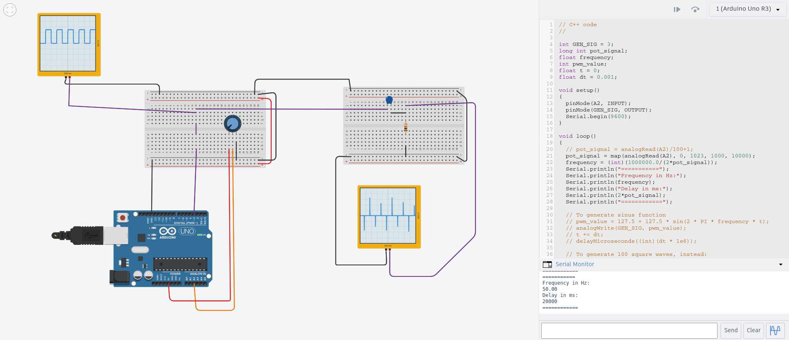
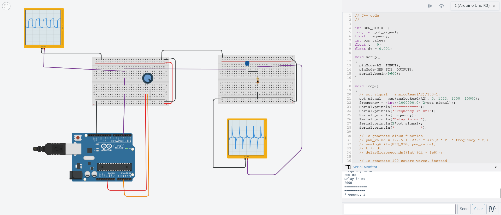

# Frequency Generator and RC High-Pass Filter Experiment

## Overview

This project demonstrates **digital square wave generation with an Arduino** and the interaction of this signal with a **simple RC high-pass filter**.  

- Frequency is controlled via a potentiometer connected to an analog input.  
- The same Arduino sketch (`square_wave.ino`) is used for multiple experimental setups: raw square wave output and filtered output.  
- All experiments were developed and tested in **Tinkercad**. Screenshots and a link to the online simulation are provided.

This experiment serves both as a **learning tool for embedded programming** and as a **didactic demonstration** of analog-digital interaction.

---

## Setup Instructions

1. Open `highpass.ino` in Arduino IDE or Tinkercad.  
2. Connect the potentiometer to analog pin `A2` and digital output to pin `GEN_SIG`.  
3. Connect the RC high-pass filter (example: `R = 100 Ω`, `C = 1 µF`) to the output pin.  
4. Observe signals with an oscilloscope or Tinkercad virtual oscilloscope.  
5. Adjust the potentiometer to explore low and high frequency behavior.

> Note: The code allows generation of single square waves or bursts of 100 waves to improve oscilloscope visualization.

[Open High_Pass_Filter in Tinkercad](https://www.tinkercad.com/things/dUEnp78An0c-highpassfilter)


---

## Results

### Low-Frequency Square Wave


- Potentiometer set for ~200 Hz output.  
- Observe the raw square wave on the Arduino output pin.  
- After the RC high-pass filter, low-frequency components are **heavily attenuated**, producing small voltage spikes.  

### High-Frequency Square Wave


- Potentiometer set for ~2000 Hz output.  
- Square wave is sharper, nearly symmetric.  
- Filter passes most of the signal, producing clearer **positive and negative peaks**.  

### Observations
- The **high-pass filter attenuates low frequencies** as expected.  
- Square waves are limited to **positive voltage only** at the Arduino output (0–5V).  
- Negative peaks seen in the filtered signal are due to **capacitor discharge** in the RC filter.

---

## Technical Notes

### ADC Limitations
- The Arduino ADC can only measure voltages between 0–5V.  
- The sampling rate (~10 kHz default) is too slow to capture **fast square wave transitions** reliably.  
- If you try to compute energy of the filtered signal with `analogRead`, you will get **almost constant values** or averaged results, not the true fast waveform.  

### Energy Calculation Concept
- Energy can be estimated by taking multiple ADC samples and computing the average absolute deviation from mid-supply (`512` for 10-bit ADC).  
- This works better at **low frequencies**, but high-frequency transients are **lost due to slow sampling**.  
- In simulation (Tinkercad) or with a fast oscilloscope, the energy calculation can be visualized accurately.

### Frequency and Timing
- `pot_signal` controls the **half-period** of the square wave in microseconds.  
- Frequency is calculated as:  

```
frequency = 1000000.0 / (2 * pot_signal); // in Hz
```
